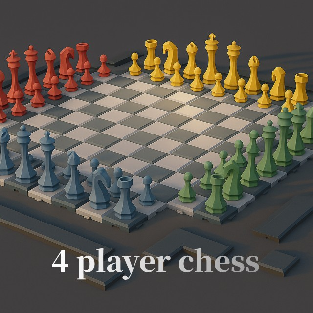

 # ♟️ 4인 체스 (4-Player Chess)

**젯슨나노 터치패드 최적화 4인 체스 게임**

[](COPYING.md)  [](https://python.org)  [](https://riverbankcomputing.com/software/pyqt/)  [](https://developer.nvidia.com/embedded/jetson-nano)

<p align='center'>
	
</p>

## 📋 프로젝트 개요

**이 프로젝트**는 기존 4인 체스 게임을 젯슨나노 터치패드 환경에 최적화하여 수정한 버전입니다. 터치 인터페이스에 맞춰 UI를 개선하고, 게임 종료 및 카운터 기능을 추가하여 사용자 경험을 향상시켰습니다.

### 🎯 프로젝트 목표

* 🎮 **터치 최적화**: 젯슨나노 터치패드에 최적화된 UI/UX
* ♟️ **4인 체스 게임**: 빨강·노랑 vs 파랑·초록 팀 전투
* 🖥️ **풀스크린 모드**: 전체 화면 게임 경험
* 🔧 **게임 제어**: ESC, Ctrl+Q 등 다양한 종료 방법 지원
* 🎵 **사운드 시스템**: 체스 이동 및 게임 효과음 지원

## 🚀 주요 기능

1. **4인 체스 게임플레이**
   * 160칸 확장 보드 (기존 8×8에서 상하좌우 3줄씩 확장)
   * 팀 기반 전투: 빨강·노랑 vs 파랑·초록
   * 폰 승진 시스템 (11행 도달 시)
   * 체크메이트/스테일메이트 승리 조건

2. **터치패드 최적화**
   * 터치 인터페이스에 최적화된 UI
   * 직관적인 드래그 앤 드롭 체스 기물 이동
   * 반응형 보드 레이아웃

3. **게임 제어 시스템**
   * ESC 키: 즉시 게임 종료
   * Ctrl+Q: 프로그램 종료
   * Ctrl+C: 터미널에서 강제 종료
   * 창 최상위 유지 기능

4. **AI 플레이어 지원**
   * 다양한 AI 전략 (Minimax, Random, Custom)
   * 난이도 조절 가능
   * 프리무브 시스템

## 🔧 하드웨어 요구사항

* **제어부**: NVIDIA Jetson Nano / PC
* **터치 시스템**: 터치패드 또는 터치스크린
* **디스플레이**: 최소 800×800 해상도 권장

## 💻 소프트웨어 스택

* **언어**: Python 3.8+
* **GUI**: PyQt5
* **게임 로직**: Custom Chess Engine
* **사운드**: PyQt5 Multimedia
* **AI**: Minimax Algorithm
* **운영체제**: Ubuntu 18.04+ / JetPack 4.6+

## 📁 프로젝트 구조

```
4PlayerChess/
├── app.py                    # 메인 애플리케이션 진입점
├── gui/                      # GUI 관련 모듈
│   ├── main.py              # 메인 윈도우 클래스
│   ├── board.py             # 체스 보드 로직
│   ├── view.py              # 보드 뷰 및 렌더링
│   ├── algorithm.py         # 체스 알고리즘
│   ├── sound_manager.py     # 사운드 관리
│   └── promotion_dialog.py  # 폰 승진 다이얼로그
├── actors/                   # AI 플레이어 모듈
│   ├── generate_actors.py   # AI 생성기
│   ├── minimaxStrategy.py   # Minimax AI
│   ├── randomStrategy.py    # 랜덤 AI
│   └── evaluation.py        # 보드 평가 함수
├── resources/                # 게임 리소스
├── data/                     # 게임 데이터
└── ui/                       # UI 리소스
```

## 🛠️ 설치 및 실행

### 필수 요구사항

* Python 3.8 이상
* PyQt5
* 터치패드 또는 마우스 입력 장치
* NVIDIA Jetson Nano (권장)

### 젯슨나노 환경 설정

```bash
# 시스템 업데이트
sudo apt update && sudo apt upgrade

# Python 및 PyQt5 설치
sudo apt install python3-pip python3-pyqt5

# 추가 의존성 설치
sudo apt install python3-dev libpython3-dev
```

### 실행 방법

```bash
# 게임 런처를 통한 실행 (권장)
python3 launcher.py

# 직접 실행
python3 app.py

# 특정 AI 설정으로 실행
python3 app.py --ai-level 3
```

## 🎮 게임 조작법

### 기본 조작
* **체스 기물 이동**: 터치하여 기물 선택 후 목적지 터치
* **드래그 앤 드롭**: 기물을 드래그하여 이동
* **폰 승진**: 11행 도달 시 자동으로 승진 다이얼로그 표시

### 게임 제어
* **ESC**: 게임 종료
* **Ctrl+Q**: 프로그램 종료
* **Ctrl+C**: 터미널에서 강제 종료

## 🔄 개발 진행 상황

* ✅ 터치패드 최적화 완료
* ✅ 게임 종료 기능 추가
* ✅ 카운터 시스템 구현
* ✅ 풀스크린 모드 지원
* ✅ 사운드 시스템 통합
* 🚧 추가 AI 전략 개발 예정

## 🔧 기술적 특징

* **터치 최적화**: 터치 인터페이스에 맞춘 UI/UX 설계
* **반응형 보드**: 다양한 화면 크기에 대응하는 보드 레이아웃
* **AI 엔진**: Minimax 알고리즘 기반 체스 AI
* **사운드 시스템**: 체스 기물 이동 및 게임 효과음
* **프로세스 관리**: 안전한 게임 종료 및 리소스 정리
* **젯슨나노 최적화**: ARM64 아키텍처에 최적화된 성능

## 📄 라이선스

이 프로젝트는 [GNU General Public License v3.0](COPYING.md) 하에 배포됩니다.

### 출처
* **원본 프로젝트**: [mvvollmer/4PlayerChess](https://github.com/mvvollmer/4PlayerChess/tree/miles-branch)
* **라이선스**: [GNU GPL v3.0](https://github.com/GammaDeltaII/4PlayerChess/blob/master/COPYING.md)
