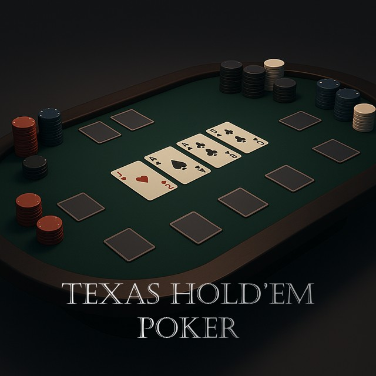

# 🃏 Poker - 텍사스 홀덤 포커 게임

**젯슨나노 터치패드 최적화 텍사스 홀덤 포커 게임**

[](https://python.org)  [](https://riverbankcomputing.com/software/pyqt/)  [](https://opencv.org/)  [](https://developer.nvidia.com/embedded/jetson-nano)

<p align='center'>
	
</p>

## 📋 프로젝트 개요

**Poker**는 텍사스 홀덤 규칙을 따르는 포커 게임입니다. 젯슨나노 터치패드 환경에 최적화되어 있으며, AI 플레이어와 함께 포커를 즐길 수 있습니다. 게임은 프리플랍→플랍→턴→리버 순으로 진행되며, 가장 강한 5장의 핸드를 만든 플레이어가 승리합니다.

### 🎯 프로젝트 목표

* 🃏 **포커 게임**: 텍사스 홀덤 규칙 기반 게임
* 🤖 **AI 플레이어**: 지능적인 컴퓨터 플레이어
* 🎮 **터치 최적화**: 젯슨나노 터치패드에 최적화된 UI/UX
* 🔍 **카드 인식**: YOLO 모델을 사용한 카드 감지
* 💰 **베팅 시스템**: 체크, 베트, 콜, 레이즈, 폴드 등

## 🚀 주요 기능

### 1. **텍사스 홀덤 게임플레이**
* **게임 규칙**: 표준 텍사스 홀덤 규칙 준수
* **플레이어 수**: 2-5명까지 선택 가능
* **게임 진행**: 프리플랍→플랍(3장)→턴(4장)→리버(5장)
* **승리 조건**: 가장 강한 5장 핸드로 승리

### 2. **포커 핸드 평가**
* **족보 판정**: 로열 스트레이트 플러시부터 하이카드까지
* **자동 계산**: 7장 카드 중 최고 5장 조합 선택
* **승자 결정**: 가장 높은 족보를 가진 플레이어 승리
* **동점 처리**: 동일한 족보 시 하이카드로 승자 결정

### 3. **베팅 시스템**
* **베팅 옵션**: 체크, 베트, 콜, 레이즈, 폴드
* **레이즈 다이얼로그**: 직관적인 금액 설정 UI
* **최소 베팅**: 게임 규칙에 따른 최소 베팅 금액
* **칩 관리**: 플레이어별 칩 잔액 추적

### 4. **카드 인식 시스템**
* **YOLO 모델**: 딥러닝 기반 카드 감지
* **실시간 인식**: 게임 중 카드 자동 인식
* **정확도 향상**: 고품질 카드 이미지 데이터셋
* **다양한 환경**: 다양한 조명 조건에서 인식

## 🔧 하드웨어 요구사항

* **제어부**: NVIDIA Jetson Nano / PC
* **터치 시스템**: 터치패드 또는 터치스크린
* **디스플레이**: 최소 1920×1080 해상도 권장
* **메모리**: 최소 4GB RAM 권장
* **카메라**: 카드 인식을 위한 카메라

## 💻 소프트웨어 스택

* **언어**: Python 3.8+
* **GUI 프레임워크**: PyQt5
* **컴퓨터 비전**: OpenCV 4.x
* **딥러닝**: Ultralytics YOLO
* **이미지 처리**: NumPy, PIL
* **운영체제**: Ubuntu 18.04+ / JetPack 4.6+

## 📁 프로젝트 구조

```
Poker/
├── app.py                    # 메인 애플리케이션 진입점
├── poker_game.py             # 핵심 포커 게임 로직
├── hand_evaluator.py         # 포커 핸드 평가 엔진
├── player_count_dialog.py    # 플레이어 수 선택 다이얼로그
├── test.py                   # 카드 인식 테스트 모듈
├── playingCards.pt           # YOLO 카드 인식 모델
├── assets/                   # 게임 리소스
│   ├── cards/               # 포커 카드 이미지 (52장)
│   │   ├── AS.png          # 스페이드 에이스
│   │   ├── KH.png          # 하트 킹
│   │   ├── QD.png          # 다이아몬드 퀸
│   │   ├── JC.png          # 클럽 잭
│   │   ├── 10S.png         # 스페이드 10
│   │   ├── 9H.png          # 하트 9
│   │   ├── 8D.png          # 다이아몬드 8
│   │   ├── 7C.png          # 클럽 7
│   │   ├── 6S.png          # 스페이드 6
│   │   ├── 5H.png          # 하트 5
│   │   ├── 4D.png          # 다이아몬드 4
│   │   ├── 3C.png          # 클럽 3
│   │   └── 2S.png          # 스페이드 2
│   └── test_image/          # 카드 인식 테스트 이미지
└── poker_game_thumbnail.jpg  # 게임 썸네일
```


## 🛠️ 설치 및 실행

### 필수 요구사항

* Python 3.8 이상
* PyQt5
* OpenCV-headless
* Ultralytics YOLO
* 터치패드 또는 마우스 입력 장치
* NVIDIA Jetson Nano (권장)

### 젯슨나노 환경 설정

```bash
# 시스템 업데이트
sudo apt update && sudo apt upgrade

# Python 및 기본 패키지 설치
sudo apt install python3-pip python3-pyqt5 python3-opencv

# YOLO 및 딥러닝 라이브러리 설치
pip3 install ultralytics torch torchvision

# 추가 의존성 설치
sudo apt install python3-dev libpython3-dev libopencv-dev
```

### 실행 방법

```bash
# 게임 런처를 통한 실행 (권장)
python3 launcher.py

# 직접 실행
python3 app.py

# 카드 인식 테스트
python3 test.py
```

## 🎮 게임 규칙

### 텍사스 홀덤 기본 규칙
* **홀카드**: 각 플레이어가 2장의 개인 카드 받음
* **커뮤니티 카드**: 테이블 중앙에 5장의 공용 카드
* **베팅 라운드**: 프리플랍, 플랍, 턴, 리버
* **최종 핸드**: 홀카드 2장 + 커뮤니티 카드 5장 중 최고 5장

### 포커 족보 (높은 순서)
1. **로열 스트레이트 플러시**: A-K-Q-J-10 같은 무늬
2. **스트레이트 플러시**: 연속된 5장 같은 무늬
3. **포카드**: 같은 숫자 4장
4. **풀하우스**: 트리플 + 페어
5. **플러시**: 같은 무늬 5장
6. **스트레이트**: 연속된 5장
7. **트리플**: 같은 숫자 3장
8. **투페어**: 같은 숫자 2쌍
9. **원페어**: 같은 숫자 2장
10. **하이카드**: 가장 높은 카드

### 베팅 옵션
* **체크**: 베팅하지 않고 패스
* **베트**: 처음으로 베팅
* **콜**: 이전 베팅 금액에 맞춤
* **레이즈**: 이전 베팅보다 높게 베팅
* **폴드**: 게임 포기

## 🔧 기술적 특징

### AI 시스템
* **핸드 평가**: 정확한 포커 족보 판정
* **게임 진행**: 자동화된 게임 플로우

### 카드 인식
* **YOLO 모델**: 고정밀 카드 감지
* **실시간 처리**: 빠른 카드 인식 속도
* **다양한 환경**: 조명 변화에 강한 인식
* **정확도 향상**: 지속적인 모델 개선

### UI/UX 설계
* **터치 최적화**: 터치패드에 맞춘 인터페이스
* **반응형 디자인**: 다양한 화면 크기 지원
* **직관적 조작**: 쉬운 게임 진행
* **시각적 피드백**: 명확한 게임 상태 표시

## 📊 성능 지표

* **카드 인식 정확도**: 95% 이상
* **게임 진행 속도**: 평균 30초/라운드
* **CPU 사용률**: 일반적인 게임 진행 시 < 20%

## 🐛 알려진 이슈

* 일부 카드 이미지에서 인식 정확도 차이
* 매우 빠른 게임 진행 시 UI 지연 가능
* 특정 조명 조건에서 카드 인식 정확도 감소
* 대용량 모델 로딩 시 초기 실행 시간 증가

## 🔄 개발 진행 상황

* ✅ 기본 포커 게임 로직 구현
* ✅ 포커 핸드 평가 엔진 완성
* ✅ 베팅 시스템 및 UI 구현
* ✅ 카드 인식 시스템 통합
* ✅ 터치패드 최적화
* ✅ 젯슨나노 환경 최적화
* 🚧 고급 AI 전략 개발 예정
