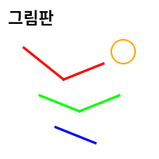

# 🎨 SimplePaint - 터치패드 드래그 테스트 그림판

**젯슨나노 터치패드 최적화 간단한 그림판 게임**

[](https://python.org)  [](https://riverbankcomputing.com/software/pyqt/)  [](https://developer.nvidia.com/embedded/jetson-nano)

<p align='center'>
	
</p>

## 📋 프로젝트 개요

**SimplePaint**는 터치패드의 드래그 기능을 테스트하기 위한 간단한 그림판 애플리케이션입니다. 젯슨나노 터치패드 환경에 최적화되어 있으며, 마우스 클릭과 드래그가 정상적으로 작동하는지 확인할 수 있습니다.

### 🎯 프로젝트 목표

* 🎨 **그림판 기능**: 자유로운 그림 그리기 및 창작
* 🖱️ **터치 테스트**: 터치패드 드래그 기능 검증
* 🎨 **색상 도구**: 다양한 색상과 선 굵기로 그림 그리기
* 🧹 **편집 도구**: 지우개 및 전체 지우기 기능
* 📱 **반응형 UI**: 다양한 화면 크기에 대응하는 인터페이스

## 🚀 주요 기능

### 1. **그림 그리기 시스템**
* **자유 그리기**: 터치패드/마우스로 자유롭게 선 그리기
* **부드러운 선**: 안티앨리어싱을 적용한 부드러운 선 표현
* **실시간 그리기**: 드래그하는 동안 실시간으로 선 표시
* **반응형 캔버스**: 화면 크기에 맞춰 자동 조정

### 2. **그리기 도구**
* **색상 선택**: 색상 대화상자로 원하는 색상 선택
* **선 굵기 조절**: 슬라이더와 스핀박스로 1-20px 범위 조절
* **색상 미리보기**: 현재 선택된 색상을 실시간으로 표시
* **도구 전환**: 그리기 도구와 지우개 도구 간 전환

### 3. **편집 기능**
* **지우개**: 흰색으로 특정 부분 지우기
* **전체 지우기**: 캔버스를 완전히 초기화
* **실행 취소**: 실시간으로 변경사항 적용
* **캔버스 관리**: 효율적인 메모리 관리

### 4. **터치패드 테스트**
* **드래그 감지**: 터치패드 드래그 동작 실시간 모니터링
* **이벤트 추적**: 마우스 클릭, 이동, 릴리즈 이벤트 추적
* **상태 표시**: 현재 터치패드 동작 상태 표시
* **디버그 정보**: 상세한 이벤트 정보 출력

## 🔧 하드웨어 요구사항

* **제어부**: NVIDIA Jetson Nano / PC
* **터치 시스템**: 터치패드 또는 터치스크린
* **입력 장치**: 마우스 또는 터치패드

## 💻 소프트웨어 스택

* **언어**: Python 3.8+
* **GUI 프레임워크**: PyQt5
* **그래픽 엔진**: Qt Graphics
* **이벤트 처리**: Qt Event System
* **운영체제**: Ubuntu 18.04+ / JetPack 4.6+

## 📁 프로젝트 구조

```
SimplePaint/
├── app.py                    # 메인 애플리케이션 진입점
├── simple_paint.py           # 핵심 그림판 애플리케이션
├── create_thumbnail.py       # 썸네일 이미지 생성기
├── thumbnail.png             # 게임 썸네일 이미지
└── description.txt           # 게임 설명 파일
```

### 핵심 클래스 구조

```python
# 메인 윈도우 클래스
class SimplePaintGame(QMainWindow):
    - UI 초기화 및 레이아웃 관리
    - 컨트롤 패널 및 도구 관리
    - 이벤트 처리 및 상태 표시

# 캔버스 클래스
class Canvas(QFrame):
    - 그림 그리기 로직
    - 마우스/터치 이벤트 처리
    - 캔버스 관리 및 렌더링
```

## 🛠️ 설치 및 실행

### 필수 요구사항

* Python 3.8 이상
* PyQt5
* 터치패드 또는 마우스 입력 장치
* NVIDIA Jetson Nano (권장)

### 젯슨나노 환경 설정

```bash
# 시스템 업데이트
sudo apt update && sudo apt upgrade

# Python 및 PyQt5 설치
sudo apt install python3-pip python3-pyqt5

# 추가 의존성 설치
sudo apt install python3-dev libpython3-dev
```

### 실행 방법

```bash
# 게임 런처를 통한 실행 (권장)
python3 launcher.py

# 직접 실행
python3 app.py
```

## 🎮 사용법

### 기본 그리기
* **그림 그리기**: 터치패드/마우스로 드래그하여 선 그리기
* **색상 변경**: "색상 선택" 버튼으로 원하는 색상 선택
* **선 굵기 조절**: 슬라이더나 스핀박스로 선 굵기 조절

### 도구 사용
* **지우개**: "지우개" 버튼으로 흰색 지우개 모드 활성화
* **전체 지우기**: "전체 지우기" 버튼으로 캔버스 초기화
* **색상 미리보기**: 현재 선택된 색상을 실시간으로 확인

### 터치패드 테스트
* **드래그 테스트**: 터치패드로 자유롭게 드래그하여 동작 확인
* **이벤트 모니터링**: 상태 표시줄에서 터치 이벤트 확인
* **반응성 테스트**: 다양한 속도와 압력으로 터치 테스트

## 🔧 기술적 특징

### UI/UX 설계
* **모던한 디자인**: Fusion 스타일의 깔끔한 인터페이스
* **직관적 조작**: 직관적인 버튼 배치와 색상 코딩
* **반응형 레이아웃**: 다양한 화면 크기에 대응하는 레이아웃
* **상태 피드백**: 실시간 상태 정보 및 피드백 제공

### 성능 최적화
* **효율적인 렌더링**: QPixmap 기반의 최적화된 캔버스
* **메모리 관리**: 적절한 메모리 할당 및 해제
* **이벤트 처리**: 빠른 터치/마우스 이벤트 응답
* **화면 업데이트**: 필요한 부분만 효율적으로 업데이트

### 터치패드 최적화
* **터치 이벤트**: 터치패드 전용 이벤트 처리
* **드래그 감지**: 정확한 드래그 동작 감지 및 처리
* **압력 감지**: 터치 압력에 따른 반응성 향상
* **멀티터치**: 향후 멀티터치 지원을 위한 확장성


## 🐛 알려진 이슈

* 매우 빠른 드래그 시 일부 선이 누락될 수 있음
* 특정 터치패드에서 압력 감지 정확도 차이
* 대용량 캔버스에서 메모리 사용량 증가
* 일부 해상도에서 UI 요소 배치 조정 필요

## 🔄 개발 진행 상황

* ✅ 기본 그림판 기능 구현
* ✅ 색상 선택 및 선 굵기 조절
* ✅ 지우개 및 전체 지우기 기능
* ✅ 터치패드 이벤트 처리
* ✅ 반응형 UI 구현
* ✅ 젯슨나노 환경 최적화
* 🚧 멀티터치 지원 개발 예정
* 🚧 그림 저장/불러오기 기능 예정
